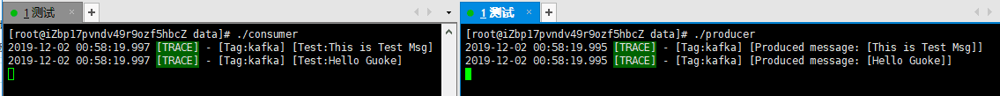

# kafka
## 生成产测试producer.go
```go
package main

import (
	"github.com/zngw/log"
	"github.com/zngw/kafka"
	"os/signal"
	"runtime"
	"syscall"
)

func main() {
	// 初始化日志
	log.Init(nil)

	// 初始化生产生
	kafka.InitProducer("192.168.1.29:9092")

	// 发送测试消息
	kafka.Send("Test","This is Test Msg")
	kafka.Send("Test","Hello Guoke")

	// 关闭
	kafka.Close()

	signal.Ignore(syscall.SIGHUP)
	runtime.Goexit()
}
```
## 消费者测试consumer.go
```go
package main

import (
	"github.com/zngw/log"
	"github.com/zngw/kafka"
	"os/signal"
	"runtime"
	"syscall"
)

func main() {
	// 初始化日志
	log.Init(nil)

	// 初始化消费者
	kafka.InitConsumer("127.0.0.1:9092")

	// 监听
	go func() {
		kafka.LoopConsumer("Test", TopicCallBack)
	}()

	signal.Ignore(syscall.SIGHUP)
	runtime.Goexit()
}

func TopicCallBack(data []byte) {
	log.Trace("kafka", "Test:"+string(data))
}
```
## 执行结果
